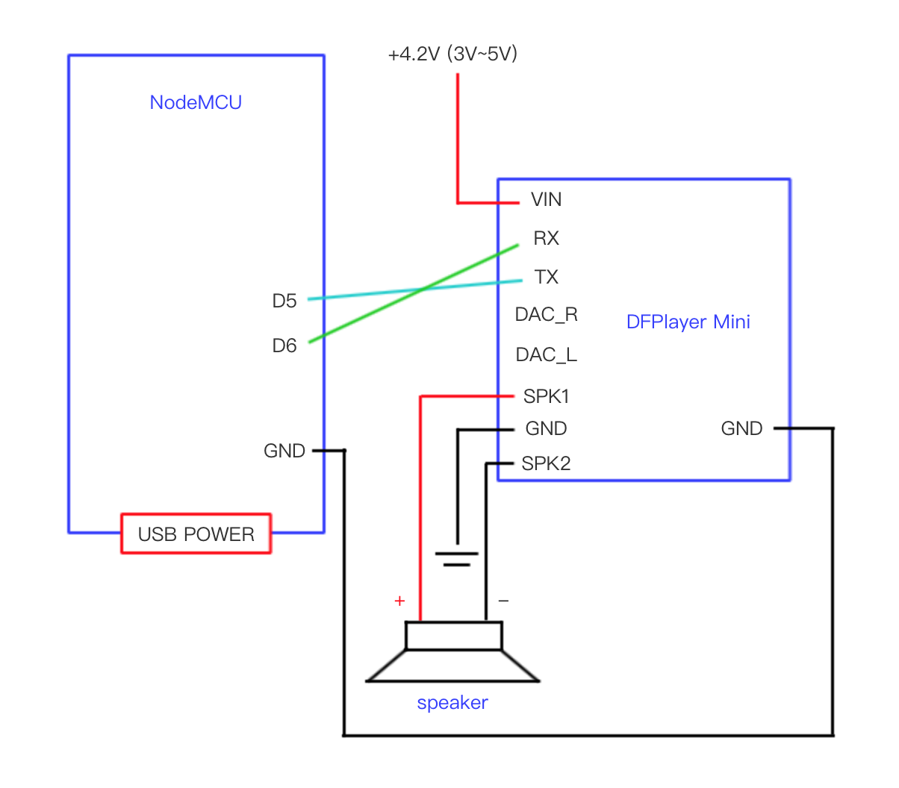
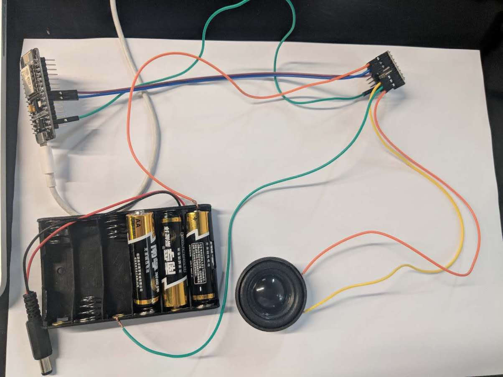

## NodeMCU MP3 player

NodeMCU 制作的 mp3 播放器

## DFPlayer Mini 模块

### 硬件清单

* NodeMCU (ESP8266)
* DFPlayer Mini 模块
* 5V usb 供电电源 (给 NodeMCU 供电)
* SD card
* 扬声器 x 2
* Amplifier PAM8403
* 1.5v 5号电池 x 3 (给 DFPlayer Mini 供电)

### 电路图一

电路图如下

实物接线图如下

需要注意的是, NodeMCU 和 DFPlayer Mini模块需单独分开供电, 防止产生噪音

### 电路图二

电路图如下

### mp3文件命名

* 命名格式 0001.mp3, 0002.mp3, 0255.mp3
* 4位数字后可以加任何字符串, 0001_blablabla.mp3
* 复制mp3到sd卡的顺序会影响播放的顺序, 比如 函数 play(1) 则会播放第一个复制到sd卡的mp3文件

## XY-V17B 模块 (噪音太大 已放弃)

* NodeMCU (ESP8266)
* XY-V17B 模块
* 5V usb 供电电源 (给 NodeMCU 供电)
* SD card
* 扬声器 x 2
* Amplifier PAM8403

